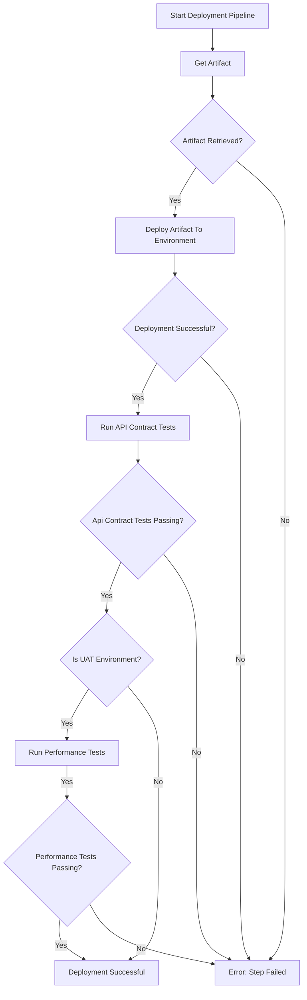

# Deployment Pipeline

## Overview

The deployment pipeline is responsible for safely and reliably delivering built application artifacts to target environments. It ensures that only validated, secure, and approved builds are deployed, and that deployments are traceable and auditable.

The deployment pipeline is responsible for:

- Getting a correct artifact for the deployment
- Deploying the artifact to the target environment
- Running post-deployment tests and health checks

## Flowchart

