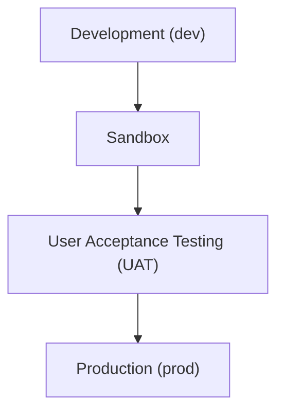

# Release Environment Propagation

## Overview
This document describes the typical release flow across environments and the key activities performed in each. It ensures that software changes are properly developed, tested, validated, and deployed with minimal risk.

---

## Release Environment Propagation

---

## Development (`dev`)

**Activities**:
- Feature development
- Unit testing
- Code reviews
- API Contract testing
- Continuous integration builds

**Purpose**:  
Rapid iteration and development of new features and fixes.

---

## Sandbox

**Activities**:
- API contract testing

**Purpose**:  
Safe, isolated testing environment for external or experimental use.

---

## User Acceptance Testing (`UAT`)

**Activities**:
- Functional testing
- Non-functional testing
- Regression testing
- Business rule validation
- Stakeholder sign-off
- API contract testing

**Purpose**:  
Final validation before production release.

---

## Production (`prod`)

**Activities**:
- Live deployment
- Monitoring and alerting
- Incident response
- User support
- Usage analytics

**Purpose**:  
Serve real users with stable, secure, and performant software.

---

## Notes

- Each environment should be **version-controlled** and **isolated** to prevent cross-contamination.
- Data used in non-prod environments should be **anonymized** or **synthetic**.
- Automated pipelines should enforce quality gates between environments.

